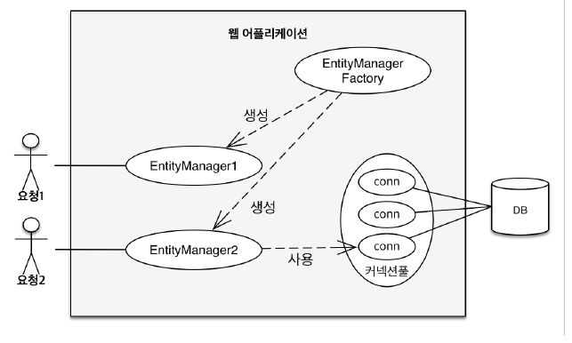
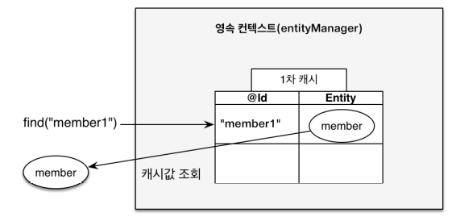
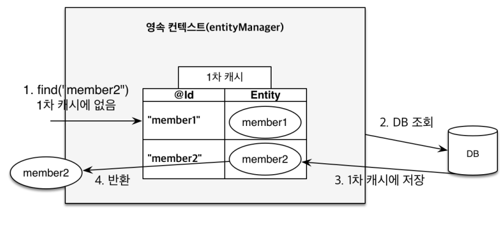
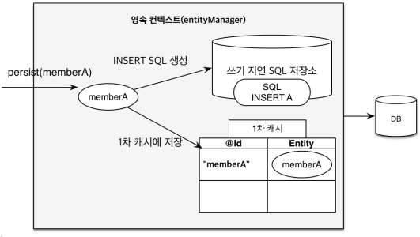
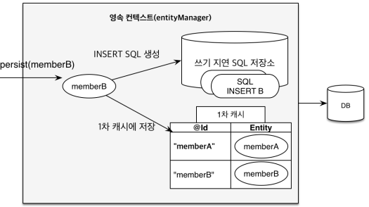
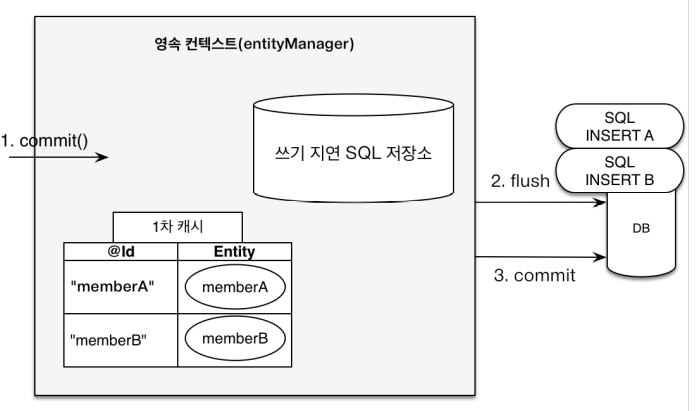
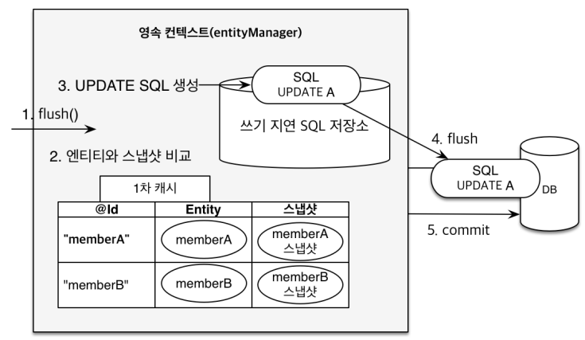

# 영속성 관리

**JPA에서 가장 중요한 2가지**

+ 객체와 관계형 데이터베이스 매핑하기(Object Relational Mapping)
+ 영속성 컨텍스트

---

## 영속성 컨텍스트



EntityManagerFactor는 고객의 요청이 올 때 마다 EntityManager를 생성

EntityManager는 내부적으로 databaseconnection을 사용해서 db를 사용

---

### 영속성 컨텍스트

+ 엔티티를 영구 저장하는 황경
+ **EnityManager.persist(entity)**

사실 persist는 db에 저장하는게 아니라 entity를 영속성 컨텍스트라는 곳에 저장한다는 뜻이다.

+ 영속성 컨텍스트는 논리적인 개념이고 눈에 보이지 않는다.
+ 영속성 컨텍스트는 엔티티 매니저를 통해서 영속성 컨텍스트에 접근한다.

### 엔티티의 생명주기

+ 비영속(new/transient)
  + 영속성 컨텍스트와 전혀 관계가 없는 새로운 상태
+ 영속(managed)
  + 영속성 컨텍스트에 관리되는 상태
+ 준영속(detached)
  + 영속성 컨텍스트에 저장되었다가 분리된 상태
+ 삭제(removed)
  + 삭제된 상태

### 비영속 

JPA와 관계없이 객체만 생성한 상태

```text
//객체를 생성한 상태

Member member = new Member();
member.setId("member1");

...
```

### 영속

entityManager안에 영속성 컨텍스트가 있는데 영속성 컨텍스트 안에 멤버를 저장한 상태 

```java
 public static void main(String[] args) {
        EntityManagerFactory emf = Persistence.createEntityManagerFactory("hello");

        EntityManager em = emf.createEntityManager();

        EntityTransaction tx = em.getTransaction();
        tx.begin();

        try{
            Member member = new Member();
            member.setId(100L);
            member.setName("HelloJPA");

            //영속
            System.out.println("==== BEFORE ====");
            em.persist(member);
            System.out.println("==== AFTER ====");

            tx.commit();


        } catch( Exception e){
            tx.rollback();
        } finally{
            em.close();
        }
        emf.close();
    }
```

해당 결과를 보면

```text
==== BEFORE ====
==== AFTER ====
Hibernate: 
    /* insert hellojpa.Member
        */ insert 
        into
            Member
            (name, id) 
        values
            (?, ?)

```

BEFORE AFTER 사이에 insert query가 날라가지 않았다.

즉 영속 상태가 된다고 db에 날아가지 않고 commit 시점에 쿼리가 날아간다.

### 준영속

영속성 컨텍스트에서 분리하여 준영속 상태가 된다.
`em.detach(member)`

### 삭제

객체를 삭제한 상태(삭제)
`em.remove(member)`

### 영속성 컨텍스트의 이점

+ 1차 캐시
+ 동일성(identity) 보장
+ 트랜잭션을 지원하는 쓰기 지연(transactional write-behind)
+ 변경 감지(Dirty Checking)
+ 지연 로딩(Lazy Loading)

### 엔티티 조회, 1차 캐시

영속 컨텍스트 내부엔 1차 캐시가 있다.

(`key`: pk `value`: 객체 자체)의 형태로 저장된다.



```text
Member member = new Member();
member.setId("member1");
member.setUsername("회원1");

em.persist(member);

Member findMember = em.find(Member.class, "member1");
```

em.find로 찾으면 우선 db가 아닌 1차 캐시를 조회한 후 객체를 반환한다.




```text
Member findMember2 = em.find(Member.class, "member2");
```

만약 db엔 있고 1차 캐시엔 없으면 db를 조회하고 db에서 조회한 member2를 1차 캐시에 저장한 후 반환한다.

하지만 1차 캐시는  db의 한 트랜잭션 안에서만 효과가 있기 때문에 큰 성능의 이점을 얻는 장점은 없다.

```java
            Member member = new Member();
            member.setId(101L);
            member.setName("HelloJPA");

            //영속
            System.out.println("==== BEFORE ====");
            em.persist(member);
            System.out.println("==== AFTER ====");

            Member findMember = em.find(Member.class, 101L);
            System.out.println("findMember.getId() = " + findMember.getId());
            System.out.println("findMember.getName() = " + findMember.getName());
            tx.commit();
```

```text
==== BEFORE ====
==== AFTER ====
findMember.getId() = 101
findMember.getName() = HelloJPA
Hibernate: 
    /* insert hellojpa.Member
        */ insert 
        into
            Member
            (name, id) 
        values
            (?, ?)
```

1차캐시에 저장이 되기 때문에 db에 select 쿼리가 나가지 않는다. 

```text
Member findMember1 = em.find(Member.class, 101L);
Member findMember2 = em.find(Member.class, 101L);

tx.commit();
```

```text
Hibernate: 
    select
        member0_.id as id1_0_0_,
        member0_.name as name2_0_0_ 
    from
        Member member0_ 
    where
        member0_.id=?
```

첫 번째 조회할 땐 1차 캐시에 없어서 db에서 조회를 하고 그 결과를 1차 캐시에 올리기 때문에 두 번 조회할 경우엔 쿼리가 한 번만 나간다.


### 영속 엔티티의 동일성 보장

JPA는 같은 트랜잭션 안에서 영속 엔티티의 동일성을 보장해준다.

```text
Member findMember1 = em.find(Member.class, 101L);
Member findMember2 = em.find(Member.class, 101L);
System.out.println("result = " + (findMember1 == findMember2));
---------------------------------------------------

result = true
```

### 엔티티 등록 - 트랜잭션을 지원하는 쓰기 지연

```text
EntityManagerFactory emf = Persistence.createEntityManagerFactory("hello");

EntityManager em = emf.createEntityManager();

EntityTransaction tx = em.getTransaction();
tx.begin();

    try{
            //영속
            Member member1 = new Member(150L,"A");
            Member member2 = new Member(160L,"B");

            em.persist(member1);
            em.persist(member2);
            System.out.println("==================");

            tx.commit();
```

트랜잭션을 시작하고 `em.persist`를 실행해도 SQL을 db에 보내지 않고 `commit`하는 순간 쿼리를 보낸다.





`persist`가 실행되면서 `쓰기 지연 SQL 저장소에` 쿼리문이 쌓임



`transaction.commit()`시점에 `flush`가 되면서 실제 `commit`이 수행된다.

### 엔티티 수정 - 변경 감지(Dirty Checking)

```text
Member member = em.find(Member.class, 150L);
member.setName("HD");
System.out.println("==================");
tx.commit();
```

```text
Hibernate: 
    select
        member0_.id as id1_0_0_,
        member0_.name as name2_0_0_ 
    from
        Member member0_ 
    where
        member0_.id=?
==================
Hibernate: 
    /* update
        hellojpa.Member */ update
            Member 
        set
            name=? 
        where
            id=?
```



Update쿼리를 날리지 않고 `setName`메소드 실행 만으로 update가 수행된다.

JPA는 commit하는 시점에 내부적으로 엔티티와 스냅샷을 비교한 뒤 다르면 `쓰기 지연 SQL 저장소에` 쿼리문을 생성한 다음 db에 반영한다.

### 엔티티 삭제

update처럼 commit 시점에 delete 쿼리가 날아간다.

---

## 플러시

영속성 컨텍스트의 변경내용을 테이터베이스에 반영한다.

---

트랜잭션이 commit되면 flush 발생

+ 변경 감지
+ 수정된 엔티티 쓰기 지연 SQL 저장소에 등록
+ 쓰기 지연 SQL 저장소의 쿼리를 DB에 전송

### 영속성 컨텍스트를 flush하는 방법

+ em.flush() - 직접 호출
+ 트랜잭션 커밋 - 플러시 자동 호출
+ JPQL 쿼리 실행 - 플러시 자동 호출


```text
 Member member = new Member(200L,"member200");
em.persist(member);
em.flush();
System.out.println("=====================");
tx.commit();

Hibernate: 
    /* insert hellojpa.Member
        */ insert 
        into
            Member
            (name, id) 
        values
            (?, ?)
=====================
```

결과를 보면 `commit()`전에 쿼리가 날라가는 것을 확인할 수 있다.

> flush를 해도 1차 캐시는 지워지지 않는다. flush는 쓰기 지연 SQL 저장소에 쌓인 쿼리들이 DB에 반영이 되는 과정.


### 플러시는

+ 영속성 컨텍스트를 비우지 않는다.
+ 영속성 컨텍스트의 변경 내용을 DB에 동기화
+ 트랜잭션이라는 단위가 중요하다. -> 커밋 직전에만 동기화하면 된다.


---

## 준영속 상태

`영속 상태`: persist나 find로 조회할때 1차 캐시에 올라가면서 영속 상태가 된다.

`준영속 상태`: 영속 상태의 엔티티가 `영속성 컨텍스트`에서 분리(detached)

준영속 상태의 엔티티는 영속성 컨텍스트가 제공하는 기능을 사용하지 못한다.

---

```text
Member member = em.find(Member.class, 150L);
member.setName("HDDD");

//준영속
em.detach(member);

System.out.println("==================");
tx.commit();


Hibernate: 
    select
        member0_.id as id1_0_0_,
        member0_.name as name2_0_0_ 
    from
        Member member0_ 
    where
        member0_.id=?
==================
```
준영속 상태가 되면서 엔티티의 값을 변경해도 `commit()`되지 않는다.

### 준영속 상태로 만드는 방법

+ em.detach(entity)
+ em.clear()
+ em.close()