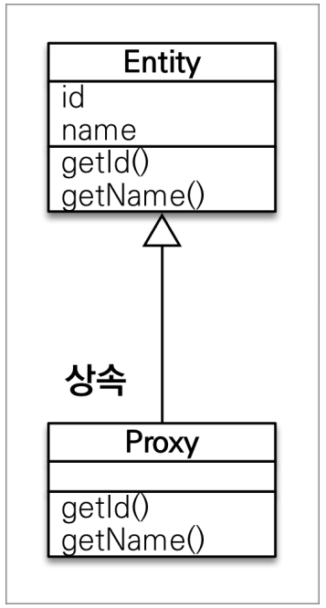
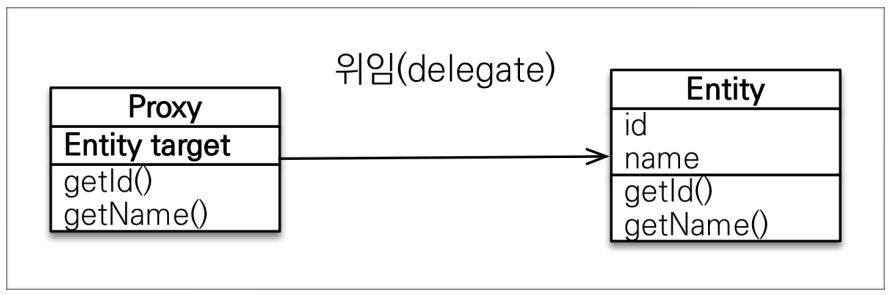

# 프록시와 연관관계 관리

---

```java
private static void printMember(Member member) {
        System.out.println("member = " + member.getUsername());
    }

private static void printMemberAndTeam(Member member) {
        String username = member.getUsername();
        System.out.println("member = " + username);

        Team team = member.getTeam();
        System.out.println("team.getName() = " + team.getName());


        }
```

Member만 출력해야하는 로직과 Member와 Team을 같이 출력해야 하는 로직이 있을 때 member만 출력하고 싶을때 연관관계가 있다고 둘 다 가져오면 낭비하게된다.

JPA는 지연로딩, 프록시로 해결한다.

---

## 프록시

JPA는 `em.find`, `em.getReference`를 제공한다.

+ `em.find`:데이터베이스를 통해 실제 엔티티 조회
+ `em.getReference`:데이터베이스 조회를 미루는 가짜(프록시) 엔티티 조회
  + DB에 쿼리가 나가지 않음

```text
Member findMember = em.getReference(Member.class, member.getId());
System.out.println("findMember = " + findMember.getClass());
System.out.println("findMember.getId = " + findMember.getId());
System.out.println("findMember.getUsername = " + findMember.getUsername());
```

`getReference`를 사용하면 id를 출력하는 라인에선 쿼리를 날리지 않고 named을 출력하는 라인에서 쿼리가 날아간다.

`System.out.println("findMember = " + findMember.getClass());`

```text
findMember = class hellojpa.Member$HibernateProxy$IYUb3gel
```

`$HibernateProxy$IYUb3gel` 가짜 클래스

`getReference`는 진짜 객체를 반환하는게 아니라 하이버네이트가 가짜 엔티티 객체를 준다.

### 프록시의 특징



+ 실제 클래스를 상속 받아서 만들어짐
+ 실제 클래스와 겉 모양이 같다.



+ 프록시 객체는 실제 객체의 참조(target)를 보관
+ 프록시 객체를 호출하면 프록시 객체는 실제 객체의 메소드 호출

### 프록시 객체의 초기화

```text
Member member = em.getReference(Member.class, id);
member.getName();
```

1. 사용자가 getName()호출
2. **프록시 객체는 영속성 컨텍스트에 초기화 요청**
3. DB조회
4. 영속성 컨텍스트가 실제 Entity 생성 후 프록시와 타겟 연결
5. target.getName()


### 프록시의 특징

+ 프록시 객체는 처음 사용할 때 한 번만 초기화 된다.
+ 프록시 객체를 초기화 할 때 **프록시 객체가 실제 엔티티로 바뀌는 것이 아니라 프록시 객체를 통해서 실제 엔티티에 접근 가능한 것이다.**
+ 프록시 객체는 원본 엔티티를 상송받음, 따라서 타입 체크시에 주의해야함 (==비교 실패, instance of를 사용해야 함)
+ 영속성 컨텍스트에 찾는 엔티티가 이미 있으면 `getReference`를 호출해도 실제 엔티티를 반환
+ 영속성 컨텍스트의 도움을 받을 수 없는 준 영속 상태일 때, 프록시를 초기화하면 문제가 발생한다.

### 프록시 확인

+ 프록시 인터스턴스의 초기화 여부
  + PersistenceUnitUtils.isLoaded(Object entity): `emf.getPersistenceUnitUtil().isLoaded(refMember));`
+ 프록시 클래스 확인 방법
  + entity.getClass(): `reftMember.getClass();`
+ 프록시 강제 초기화
  + `Hibernate.initialize(refMember);`
        

---

## 즉시 로딩과 지연 로딩

단순히 Member만 조회할 때 Team도 함께 조회해야 할까?

---

### 지연 로딩 LAZY를 사용해서 프록시로 조회

```text
@ManyToOne(fetch = FetchType.LAZY)
@JoinColumn(name = "TEAM_ID", insertable=false,updatable = false)
private Team team;
```

`fetch = FetchType.LAZY`: team을 프록시 객체로 조회함 (Member class만 DB에서 조회)

```text
Team team = new Team();
team.setName("teamA");
em.persist(team);

Member member1 = new Member();
member1.setUsername("member1");
member1.setTeam(team);
em.persist(member1);

em.flush();
em.clear();

Member m = em.find(Member.class, member1.getId());
System.out.println("m = " + m.getTeam().getClass());

System.out.println("=============");
m.getTeam().getName();
System.out.println("=============");

-----------------------------------

Hibernate: 
    select
        member0_.MEMBER_ID as member_i1_3_0_,
        member0_.INSERT_MEMBER as insert_m2_3_0_,
        member0_.createdDate as createdd3_3_0_,
        member0_.UPDATE_MEMBER as update_m4_3_0_,
        member0_.lastModifiedDate as lastmodi5_3_0_,
        member0_.team_TEAM_ID as team_tea7_3_0_,
        member0_.USERNAME as username6_3_0_ 
    from
        Member member0_ 
    where
        member0_.MEMBER_ID=?
m = class hellojpa.Team$HibernateProxy$3Kz8HctV
=============
Hibernate: 
    select
        team0_.TEAM_ID as team_id1_7_0_,
        team0_.INSERT_MEMBER as insert_m2_7_0_,
        team0_.createdDate as createdd3_7_0_,
        team0_.UPDATE_MEMBER as update_m4_7_0_,
        team0_.lastModifiedDate as lastmodi5_7_0_,
        team0_.name as name6_7_0_ 
    from
        Team team0_ 
    where
        team0_.TEAM_ID=?
=============
```

지연 로딩으로 세팅하면 연관된 것을 프록시로 가져온다.

team.getName()을 사용하는 시점에 DB를 조회해서 초기화 한다.

Member와 Team을 `EAGER`를 사용해서 함께 조회한다.

### 프록시와 즉시로딩 주의

+ 가급적 지연 로딩만 사용
+ 즉시 로딩을 적용하면 예상하지 못한 SQL이 발생
+ 즉시 로딩은 JPQL에서 N+1 문제를 일으킨다.
+ `@ManyToOne`, `@OneToOne`은 default가 즉시로딩

실무에서는 LAZY를 사용하자.

---

## 영속성 전이: CASCADE

특정 엔티티를 영속 상태로 만들 때 연관된 엔티티도 함께 영속 상태로 만들고 싶을 때 

ex) 부모 엔티티를 저장할 때 자식 엔티티도 함께 저장

### 영속성 전이 - 저장

```text
Child child1 = new Child();
Child child2 = new Child();

Parent parent = new Parent();
parent.addChild(child1);
parent.addChild(child2);

em.persist(parent);
em.persist(child1);
em.persist(child2);
```


```text
@OneToMany(mappedBy = "parent", cascade = CascadeType.ALL)
private List<Child> childList = new ArrayList<>();
```
```text
Child child1 = new Child();
Child child2 = new Child();

Parent parent = new Parent();
parent.addChild(child1);
parent.addChild(child2);

em.persist(parent);
```

cascade 설정을 하면 연관된 entity도 같이 저장할 수 있다.

### 주의

+ 영속성 전이는 연관관계를 매핑하는 것과 아무 관련이 없다.
+ 엔티티를 영속화 할 때 연관된 엔티티도 함께 영속화 하는 편리함을 제공하는 것이다.

단일 엔티티에 종속적일때는 사용해도 무방하지만 그렇지 않을 땐 따로 관리해야 한다.

### 고아 객체

+ 고아 객체 제거: 부모 엔티티와 연관관계가 끊어진 자식 엔티티를 자동으로 삭제하는 기능
+ orphanRemoval = true

```text
Parent parent1 = em.find(Parent.class,id);
parent1.getChildren().remove(0);
//자식 엔티티를 컬렉션에서 제거
```
```text
@OneToMany(mappedBy = "parent", cascade = CascadeType.ALL,orphanRemoval = true)
private List<Child> childList = new ArrayList<>();
```

참조하는 곳이 하나일 때 사용해야 한다. 

### 영속성 전이 + 고아 객체, 생명주기(CascadeType.ALL + orphanRemoval=true)

+ 스스로 생명 주기를 관리하는 엔티티는 em.persist()로 영속화, em.remove()로 제거
+ 두 옵션을 모두 활성화하면 부모 엔티티를 통해 자식의 생명 주기를 관리할 수 있다.

