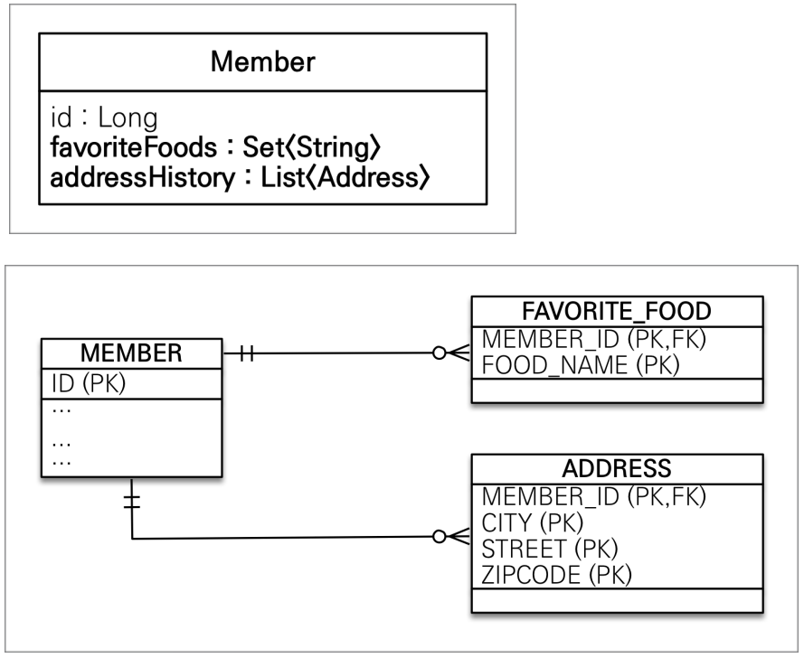

# 값 타입

---

## 기본 값 타입

---

### JPA의 데이터 타입 분류

+ 엔티티 타입
  + `@Entity`로 정의하는 객체
  + 데이터가 변해도 식별자로 지속해서 추적 가능
  + ex) 회원 엔티티의 기나 나이 값을 변경해도 식별자로 인식 가능
+ 값 타입
  + int, Integer, String 처럼 단순히 값으로 사용하는 자바 기본 타입이나 객체
  + 식별자가 없고 값만 있으므로 변경시 추적 불가
  + ex) 숫자 100을 200으로 변경하면 완전히 다른 값으로 대체


### 값 타입 분류

+ 기본값 타입
  + 자바 기본 타입(int, double)
  + 래퍼 클래스(Integer, Long)
  + String
+ 임베디드 타입(embedded type, 복합 값 타입)
+ 컬렉션 값 타입(collection value type)

### 기본 값 타입 (String, int ,,,)

+ 생명주기를 엔티티에 의존
  + 회원을 삭제하면 이름, 나이 필드도 함께 삭제된다.
+ 값 타입은 공유하면 안된다.
  + 회원 이름 변경시 다른 회원의 이름도 함께 변경하면 안된다.

> 자바의 기본 타입은 절대 공유X
> 
> int, double같은 기본타입은 절대 공유되지 않는다.
> 
> ``` int a=10; int b=a; a=20;```

## 임베디드 타입(복합 값 타입)

+ 새로운 값 타입을 직접 정의할 수 있음
+ JPA는 임베디드 타입이라고 한다.
+ 주로 기본 값(int, String,,,) 타입을 모아서 만든다.


회원 엔티티에 `id`,`name`,`startDate`,`endDate`,`city`,`street`,`zipcode`를 가지고있다고 하자

비슷한 필드를 모아서 `id`,`name`,`workPeriod`,`homeAddress`로 묶어낼 수 있는 것이 임베디드 타입이다.


### 임베디드 타입 사용법

+ `@Embeddable`: 값 타입을 정의하는 곳에 표시
+ `@Embedded`: 값 타입을 사용하는 곳에 표시
+ 기본 생성자 필수

### 임베디드 타입의 장점

+ 재사용성
+ 높은 응집도
+ Period.isWork()처럼 해당 값 타입만 사용하는 의미있는 메소드를 만들 수 있다.
+ 임베디드 타입을 포함한 모든 값 타입은, 값 타입을 소유한 엔티티에 생명주기를 의존한다.


회원 테이블 입장에선 변하는게 없고 Entity를 매핑만 해주면 된다.

기존 MEMBER Entity

```text
    @Id @GeneratedValue
    @Column(name = "MEMBER_ID")
    private Long id;

    @Column(name = "USERNAME")
    private String username;

    //기간 Period
    private LocalDateTime startDate;
    private LocalDateTime endDate;

    //주소
    private String city;
    private String street;
    private String zipcode;
```


MEMBER Entity

```text
@Entity
public class Member{

    @Id @GeneratedValue
    @Column(name = "MEMBER_ID")
    private Long id;

    @Column(name = "USERNAME")
    private String username;

    @Embedded
    private Period workPeriod;

    @Embedded
    private Address homeAddress;

}
```

PERIOD Entity
```text
@Embeddable
public class Period {

    private LocalDateTime startDate;
    private LocalDateTime endDate;
    
    //Getter Setter
    
}
```

ADDRESS Entity
```text
@Embeddable
public class Address {
    private String city;
    private String street;
    private String zipcode;
    
    //Getter Setter
}
```

### 임베디드 타입과 테이블 매핑

+ 임베디드 타입은 엔티티의 값일 뿐이다.
+ 임베디드 타입을 사용하기 전과 후에 **매핑하는 테이블은 같다**
+ 객체와 테이블은 아주 세밀하게 매핑하는것이 가능하다.
+ 잘 설계한 ORM 애플리케이션은 매핑한 테이블의 수보다 클래스의 수가 더 많다.

### @AttributeOverride

한 엔티티에서 같은 값 타입을 사용하고 싶을때 `@AttributeOverrides`, `@AttributeOverride`를 사용하여 컬럼 명 속성을 재정의한다.


```text
    @Embedded
    private Address homeAddress;

    @Embedded
    private Address workAddress;
```

위와 같이 정의하면 에러가 난다.

```text
 @Embedded
    private Period workPeriod;

    @Embedded
    @AttributeOverrides({
            @AttributeOverride(name = "city",
                    column = @Column(name = "WORK_CITY")),
            @AttributeOverride(name = "street",
                    column = @Column(name = "WORK_STREET")),
            @AttributeOverride(name = "zipcode",
                    column = @Column(name = "WORK_ZIPCODE"))
    })
    private Address homeAddress;
```
위와 같이 사용하면 테이블에 city, street, zipcode, WORK_CITY, WORK_STREET, WORK_ZIPCODE 컬럼이 생성된다.

### 임베디드 타입과 null

임베디드 타입의 값이 null이면 매핑한 컬럼 값은 모두 null이다.

workPeriod가 null이면 startDate, endDate 모두 null

---

## 값 타입과 불변 객체

---

### 값 타입 공유 참조

+ 임베디드 타입 같은 값 타입을 여러 엔티티에서 공유하면 위험하다.


```text
            Address address = new Address("city", "street", "10000");

            Member member = new Member();
            member.setUsername("member1");
            member.setHomeAddress(address);
            em.persist(member);

            Member member2 = new Member();
            member2.setUsername("member2");
            member2.setHomeAddress(address);
            em.persist(member2);

            member.getHomeAddress().setCity("newCity");

            tx.commit();
```

위의 경우 member1과 member2에 update 쿼리가 각 각 한번씩 총 두 번 나가게 된다.

### 값 타입 복사

+ 값 타입의 실제 인스턴스 값을 공유하는 것은 위험하다.
+ 값을 복사해서 사용해야 한다.

```text
            Address address = new Address("city", "street", "10000");

            Member member = new Member();
            member.setUsername("member1");
            member.setHomeAddress(address);
            em.persist(member);

            Address copyAddress = new Address(address.getCity(), address.getStreet(), address.getZipcode());

            Member member2 = new Member();
            member2.setUsername("member2");
            member2.setHomeAddress(copyAddress);
            em.persist(member2);

            member.getHomeAddress().setCity("newCity");
```

### 객체 타입의 한계

+ 항상 값을 복사해서 사용하면 발생하는 부작용을 피할 수 있다.
+ 임베디드 타입처럼 직접 정의한 값 타입은 자바의 기본 타입이 아니라 객체 타입이다.
+ 자바 기본 타입에 값을 대입하면 값을 복사한다.
+ **객체 타입은 참조 값을 직접 대입하는 것을 막을 방법이 없다.**
+ **객체의 공유 참조는 피할 수 없다.**

### 불변 객체

+ 객체 타입을 수정할 수 없게 만든다.
+ 값 타입은 불변객체로 설계해야 한다.
+ **불변 객체: 생성 시점 이후 절대 값을 변경할 수 없는 객체**
+ 생성자로만 값을 설정하고 수정자를 만들지 않으면 된다.(또는 Setter를 private으로)

기존의 값을 변경하고 싶을 때 new Address를 통으로 갈아끼우면 된다.

```text
            Address address = new Address("city", "street", "10000");

            Member member = new Member();
            member.setUsername("member1");
            member.setHomeAddress(address);
            em.persist(member);

            Address newAddress = new Address("NewCity", address.getStreet(), address.getZipcode());
            member.setHomeAddress(newAddress);
```

---

## 값 타입의 비교

값 타입: 인스턴스가 달라도 그 안에 값이 같으면 같은 것으로 봐야한다.

```text
int a = 10;
int b = 10;
System.out.println("a == b: " + (a == b));
==========================================
a == b: true


Address a = new Address("city", "street", "10000");
Address b = new Address("city", "street", "10000");
System.out.println("a == b: " + (a == b));
==========================================
a == b: false
```

---

### 값 타입의 비교

+ **동일성(identity) 비교**: 인스턴스의 참조 값을 비교, == 사용
+ **동등성(equivalence) 비교**: 인스턴스의 값을 비교, equals() 사용
+ 값 타입은 a.equals(b)를 사용해서 동등성 비교를 해야 함
+ 값 타입의 equals() 메소드를 적절하게 재정의해야함


```text
    @Override
    public boolean equals(Object o) {
        if (this == o) return true;
        if (o == null || getClass() != o.getClass()) return false;
        Address address = (Address) o;
        return Objects.equals(city, address.city) && Objects.equals(street, address.street) && Objects.equals(zipcode, address.zipcode);
    }

    @Override
    public int hashCode() {
        return Objects.hash(city, street, zipcode);
    }
    
Address a = new Address("city", "street", "10000");
Address b = new Address("city", "street", "10000");
System.out.println("a == b: " + (a == b));
==========================================
a == b: false
a equals b: true
```

---

## 값 타입 컬렉션



테이블에 값들만 저장하고 묶어서 pk로 구성하면 된다.

+ 값 타입을 하나 이상 저장할 때 사용
+ `@ElementCollection`, `@CollectionTable`사용
+ 데이터베이스는 컬렉션을 같은 테이블에 저장할 수 없다.
+ 컬렉션을 저장하기 위한 별도의 테이블이 필요하다.
---

```java
@Entity
public class Member {

  @Id
  @GeneratedValue
  @Column(name = "MEMBER_ID")
  private Long id;

  @Column(name = "USERNAME")
  private String username;

  @Embedded
  private Address homeAddress;

  @ElementCollection
  @CollectionTable(name = "FAVORITE_FOOD", joinColumns =
  @JoinColumn(name = "MEMBER_ID"))
  @Column(name = "FOOD_NAME")
  private Set<String> favoriteFoods = new HashSet<>();

  @ElementCollection
  @CollectionTable(name = "ADDRESS", joinColumns =
  @JoinColumn(name = "MEMBER_ID"))
  private List<Address> addressHistory = new ArrayList<>();
  
  //Getter, Setter
}
```

```text
            Member member = new Member();
            member.setUsername("member1");
            member.setHomeAddress(new Address("homeCity","street","10000"));

            member.getFavoriteFoods().add("치킨");
            member.getFavoriteFoods().add("족발");
            member.getFavoriteFoods().add("피자");

            member.getAddressHistory().add(new Address("old1","street","10000"));
            member.getAddressHistory().add(new Address("old2","street","10000"));

            em.persist(member);
```

값 타입 컬렉션은 본인 스스로에 대하여 생명 주기가 없고 Member에 종속되어있다. 따로 `persist`할 필요 없고 member의 값이 바뀌면 자동으로 바뀐다.

### 값 타입 컬렉션 사용

값 타입 컬렉션은 지연 로딩 전략을 사용한다.

```text
System.out.println("================ START ===================");
            Member findMember = em.find(Member.class, member.getId());

            List<Address> addressHistory = findMember.getAddressHistory();
            for (Address address : addressHistory) {
                System.out.println("address.getCity() = " + address.getCity());
            }

            Set<String> favoriteFoods = findMember.getFavoriteFoods();
            for (String favoriteFood : favoriteFoods) {
                System.out.println("favoriteFood = " + favoriteFood);
            }
           
```

Member만 조회하는 쿼리가 나가고 AddressHistory나 FavoriteFoods를 조회하면 그때 각각 쿼리가 한 번 씩 더 나간다.

### 값 타입 컬렉션의 제약사항

+ 값 타입은 엔티티와 다르게 식별자 개념이 없다.
+ 값은 변경하면 추적이 어렵다.
+ 값 타입: 컬렉션에 변경 사항이 발생하면, 주인 엔티티와 연관된 모든 데이터를 삭제하고, 값 타입 컬렉션에 있는 현재 값을 모두 다시 저장한다.
+ 값 타입 컬렉션을 매핑하는 테이블은 모든 컬럼을 묶어서 기본 키를 구성해야 함: null X, 중복 저장X

```text
findMember.getAddressHistory().remove(new Address("old1","street","10000"));
findMember.getAddressHistory().add(new Address("newCity1","street","10000"));

-------------

Hibernate: 
    /* delete collection hellojpa.Member.addressHistory */ delete 
        from
            ADDRESS 
        where
            MEMBER_ID=?
Hibernate: 
    /* insert collection
        row hellojpa.Member.addressHistory */ insert 
        into
            ADDRESS
            (MEMBER_ID, city, street, zipcode) 
        values
            (?, ?, ?, ?)
Hibernate: 
    /* insert collection
        row hellojpa.Member.addressHistory */ insert 
        into
            ADDRESS
            (MEMBER_ID, city, street, zipcode) 
        values
            (?, ?, ?, ?)
```

delete후 모든 값을 insert한다. 

추적도 안되고 위와 같은 동작방식 때문에 위험하다.

### 값 타입 컬렉션 대안

+ 실무에서는 상황에 따라 값 타입 컬렉션 대신 **일대다 관계를 고려**하자
+ 일대다 관계를 위한 엔티티를 만들고, 여기에서 값 타입을 사용
+ 영속성 전이(Cascade) + 고아 객체 제거를 사용해서 값 타입 컬렉션처럼 사용

```java
@Entity
@Table(name = "ADDRESS")
public class AddressEntity {

  @Id
  @GeneratedValue
  private Long id;

  private Address address;

  public AddressEntity() {
  }

  public AddressEntity(Address address) {
    this.address = address;
  }

  public AddressEntity(String city, String street, String zipcode) {
    this.address = new Address(city, street, zipcode);
  }
  //Getter Setter
}
```

```text
//    @ElementCollection
//    @CollectionTable(name = "ADDRESS", joinColumns =
//    @JoinColumn(name = "MEMBER_ID"))
//    private List<Address> addressHistory = new ArrayList<>();

    @OneToMany(cascade = CascadeType.ALL, orphanRemoval = true)
    @JoinColumn(name = "MEMBER_ID")
    private List<AddressEntity> addressHistory = new ArrayList<>();
```

### 정리

값 타입은 정말 값 타입이라 판단될 때만 사용하자.

엔티티와 값 타입을 혼동해서 엔티티를 값 타입으로 만들면 안된다.

식별자가 필요하거나 추적, 변경해야 한다면 그것은 엔티티이다.

