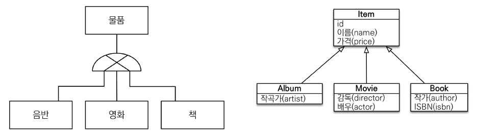
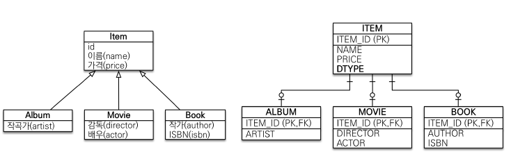
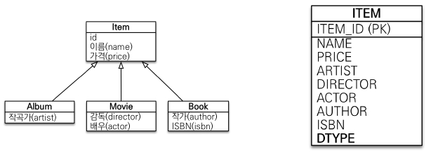
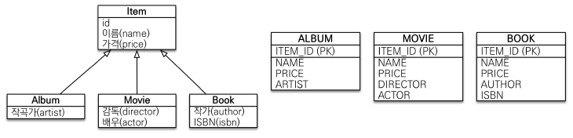

# 고급 매핑

---

## 상속관계 매핑

---

+ 관계형 데이터베이스는 상속 관계X
+ 슈퍼타입 서브타입 관계라는 모델링 기법이 객체 상속과 유사하다.
+ 상속관계 매핑: 객체의 상속 구조와 DB의 슈퍼타입 서브타입 관계를 매핑



### 슈퍼타입 서브타입 논리 모델을 물리 모델로 구현하는 방법

1. 각각 테이블로 변환(조인 전략)



ITEM, ALBUM, MOVIE, BOOK 테이블을 다 만들고 JOIN으로 가져오는것 

2. 단일 테이블 전략



논리 모델을 하나의 테이블로 다 합치는 것 

3. 구현 클래스마다 테이블을 구현 하는 전략




```java
@Entity
public abstract class Item {

    @Id @GeneratedValue
    private Long id;

    private String name;
    private int price;
}

@Entity
public class Book extends Item{

    private String author;
    private String isbn;
}

@Entity
public class Album extends Item{
    private String artist;
}

@Entity
public class Movie extends Item{

    private String director;
    private String actor;
}
```

```text
create table Item (
       DTYPE varchar(31) not null,
        id bigint not null,
        name varchar(255),
        price integer not null,
        aritst varchar(255),
        author varchar(255),
        isbn varchar(255),
        actor varchar(255),
        director varchar(255),
        primary key (id)
```

아무 설정없이 실행하면 기본적인 전략은 `SINGLE_TABLE`전략으로 실행된다.

### 조인 전략

```java
@Entity
@Inheritance(strategy = InheritanceType.JOINED)
public class Item {}
```

`@Inheritance(strategy = InheritanceType.JOINED)`을 설정하면 Item의 PK가 Movie의 PK, FK가 되어 테이블이 생성된다.

ITEM의 DTYPE이 생략되었는데 `@DiscriminatorColumn`애노테이션을 붙여주면 된다.

```text
Movie movie = new Movie();
            movie.setDirector("aaaaa");
            movie.setActor("bbbb");
            movie.setName("제목");
            movie.setPrice(10000);

            em.persist(movie);

            em.flush();
            em.clear();

            Movie findMovie = em.find(Movie.class, movie.getId());
```
 
DTYPE: Movie ,ID: 1, NAME: 제목, PRICE: 10000의 데이터가 들어온다.

DTYPE엔 default로 엔티티의 이름이 들어온다.

만약 default가 아닌 다른 이름으로 넣고 싶을 땐 자식 클래스에 `@DiscriminatorValue("A")`처럼 붙여주면 된다.

+ 장점
  + 테이블 정규화
  + FK 참조 무결성 제약조건 활용 가능
  + 저장공간 효율화
+ 단점
  + 조회 시 조인을 많이 사용해서 성능 저하
  + 조회 쿼리의 복잡함
  + 데이터 저장시 INSERT 쿼리가 2번 호출 됨
  

### 단일 테이블 전략

`@Inheritance(strategy = InheritanceType.SINGLE_TABLE)`

단일테이블 전략은 `@DiscriminatorColumn`이 없어도 `DTYPE` 컬럼이 자동으로 생성된다.

ITEM을 제외한 다른 테이블은 생성이 되지 않고 ITEM에서 DTYPE으로 관리한다.

그래서 추가,조회 쿼리가 한번밖에 나가지 않는다.

+ 장점
  + 조인이 필요 없어서 조회가 빠름
  + 조회 쿼리의 단순함
+ 단점
  + 자식 엔티티가 매핑한 컬럼은 모두 null이 허용됨
  + 단일 테이블에 모든 것을 저장하므로 테이블이 커져서 상황에 따라 조회 성능이 느려질 수 있다.
  

### 구현 클래스마다 테이블 전략

JOIN 전략과 비슷하지만 ITEM 테이블을 없애고 ITEM 속성들을 하위 테이블에 다 넣어주는 전략

`@Inheritance(strategy = InheritanceType.TABLE_PER_CLASS)`

ITEM 테이블이 생성되지 않는다.

구현 클래스마다 테이블 전략은 Item 클래스로 조회할 때 UNION ALL로 모든 모두 조회한다. 

+ 이 전략은 잘 추천되지 않음

+ 장점
  + 서브 타입을 명확하게 구분해서 처리할 때 효과적
  + not null 사용 가능
+ 단점
  + 여러 자식 테이블을 조회할 때 성능이 느림(UNION 쿼리)
  + 자식 테이블을 통합해서 쿼리하기가 힘들다.

#### 설계 시 조인 전략과 단일 테이블 전략으로만 고려하자

---

## @Mapped SuperClass - 매핑 정보 상속

```java
@MappedSuperclass
public abstract class BaseEntity {

  private String createdBy;
  private LocalDateTime createdDate;
  private String lastModifiedBy;
  private LocalDateTime lastModifiedDate;

  //Getter,Setter
}

@Entity
public class Member extends BaseEntity{}

@Entity
public class Team extends BaseEntity{}
```

`@MappedSuperClass` 애노테이션을 사용하면 상속받은 Entity에서 필드를 사용할 수 있다.

```text
create table Member (
       MEMBER_ID bigint not null,
        createdBy varchar(255),
        createdDate timestamp,
        lastModifiedBy varchar(255),
        lastModifiedDate timestamp,
        USERNAME varchar(255),
        LOCKER_ID bigint,
        TEAM_ID bigint,
        primary key (MEMBER_ID)
    )
    
create table Team (
       TEAM_ID bigint not null,
        createdBy varchar(255),
        createdDate timestamp,
        lastModifiedBy varchar(255),
        lastModifiedDate timestamp,
        name varchar(255),
        primary key (TEAM_ID)
    )
```

`BaserEntity`는 객체 입장에서 데이터만 상속하고 실제 테이블을 손대지 않는 점에서 데이터베이스에서 테이블을 분리하거나 나누게 되는 조인 전략과 다르다.


### 정리

+ 상속관계 매핑이랑은 다르다.
+ 엔티티X, 테이블과 매핑X
+ 부모 클래스를 상속 받는 자식 클래스에 매핑 정보만 제공한다.
+ 조회, 검샘이 불가하다. `(em.find(BaseEntity.class,...))`
+ 직접 생성해서 사용할 일이 없으므로 **추상 클래스로 사용**하자
