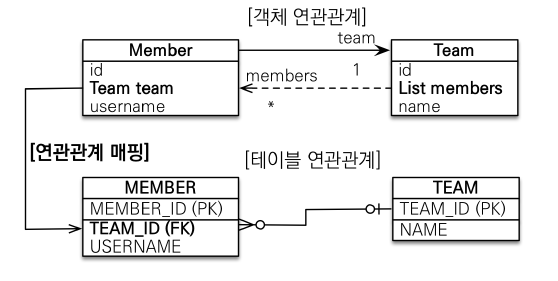
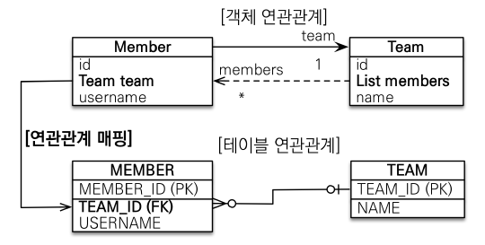
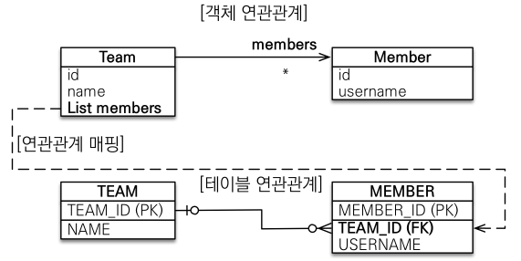
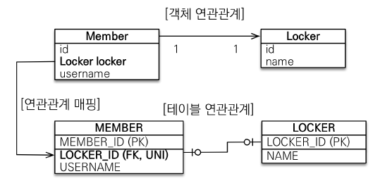
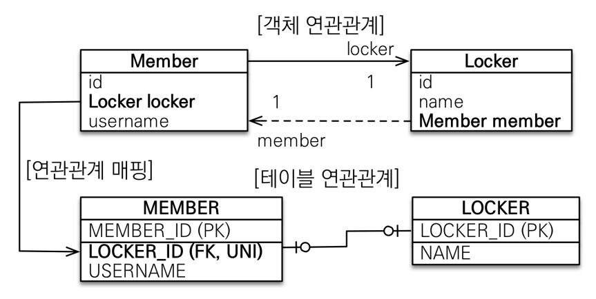

# 다양한 연관관계 매핑

---

## 연관관계 매핑시 고려사항 3가지

+ 다중성
+ 단방향, 양방향
+ 연관관계의 주인

### 다중성

+ 다대일:`@ManyToOne`
+ 일대다:`@OneToMany`
+ 일대일:`@OneToOne`
+ 다대다:`@ManyToMany`(사실 실무에서는 다대다를 사용하면 안된다.)

### 단방향

+ 테이블
  + FK 하나로 양쪽 조인 가능
  + 사실 방향이라는 개념은 없다.
+ 객체
  + 참조용 필드가 있는 쪽으로만 참조 가능
  + 한쪽만 참조하면 단방향
  + 양쪽이 서로 참조하면 양방향(객체 입장에서는 양방향은 없다. 단지 단방향이 두 개 있는 것)

### 연관관계의 주인

+ 테이블은 FK 하나로 두 테이블이 연관관계를 맺음
+ 객체는 참조가 2곳
+ 결국 FK를 관리할 곳을 정해야 한다.
+ 연관관계의 주인: FK를 관리하는 참조
+ 주인의 반대편: FK에 영향을 주지 않고 단순하게 조회만 한다.

---

## 다대일[N:1]

### 다대일 단방향



관계형 DB는 **many**쪽에 FK가 들어가는게 맞다.

다대일의 반대방향은 **일대다**

Member Entity

```text
@ManyToOne
@JoinColumn(name = "TEAM_ID")
private Team team;
```

### 다대일 양방향



Team Entity

```text
@OneToMany(mappedBy = "team")
private List<Member> members = new ArrayList<>();
```

**외래키가 있는 곳이 연관관계의 주인이다.**

---

## 일대다[1:N]

1이 있는곳이 연관관계의 주인

---

### 일대다 단방향

권장하지 않는 모델



객체에서는 Team Entity가 연관관계의 주인이고 테이블 관계에서는 FK는 MEMBER에 있는 형태

Team Entity

```text
@OneToMany
@JoinColumn(name = "TEAM_ID")
private List<Member> members = new ArrayList<>();

-----------------------

 /* create one-to-many row hellojpa.Team.members */ update
        Member 
    set
        TEAM_ID=? 
    where
        MEMBER_ID=?
```

Team Entity를 insert했는데 Member table이 update되게 된다.

실무에서는 잘 사용하지 않고 차라리 **다대일 양방향**으로 설계하는게 낫다.

+ 일대다 단방향은 1이 연관관계의 주인
+ 테이블 일대다 관계는 항상 다(N) 쪽에 FK 가 있다.
+ 객체와 테이블의 차이때문에 반대편 테이블에서 FK를 관리하는 특이한 구조
+ 일대다 단방향 매핑은 엔티티가 관리하는 FK가 다른 테이블에 있다는점이 매우 큰 단점이다.
+ **다대일 양방향 매핑을 사용**하자


### 일대다 양방향

Team Entity

```text
@OneToMany
@JoinColumn(name = "TEAM_ID")
private List<Member> members = new ArrayList<>();
```

Member Entity

```text
@ManyToOne
@JoinColumn(name = "TEAM_ID", insertable=false,updatable = false)
private Team team;
```

일대다 양방향은 공식적으로 존재하지 않는다.

`insertable, updatable`을 사용해서 읽기 전용으로 사용한다.

**다대일 양방향을 사용**하자

---

## 일대일 관계

일대일 관계는 주 테이블이나 대상 테이블에 중 FK 선택 가능하다.

FK DB에 유니크 제약조건을 추가한다.

---

### 일대일 단방향 



다대일 단방향 매핑과 유사함.

어느 방향에 FK를 넣고 유니크 제약 조건을 추가하면 일대일 관계가 된다.

### 일대일 양방향



다대일 양방향 매핑 처럼 FK가 있는 곳이 연관관계의 주인이고 반대편은 mappedBy 적용

---

## 다대다[N:M]

+ 관계형 DB는 정규화된 테이블 2개로 다대다 관계를 표현할 수 없다.
+ 연결 테이블을 추가해서, 다대일 관계로 풀어야됨
+ 객체는 컬렉션을 사용해서 객체 2개로 다대다 관계가 가능

---

`@ManyToMany`를 사용하고 `@JoinTable`로 연결 테이블의 이름을 설정

### 다대다 매핑의 한계

+ 편리해 보이지만 실무에서 사용X
+ 연결 테이블이 단순히 연결만하고 끝나지 않는다.


### 다대다 한계 극복

연결 테이블용 엔티티를 추가한다.

`@ManyToMany` -> `@OneToMany`, `@ManyToOne`