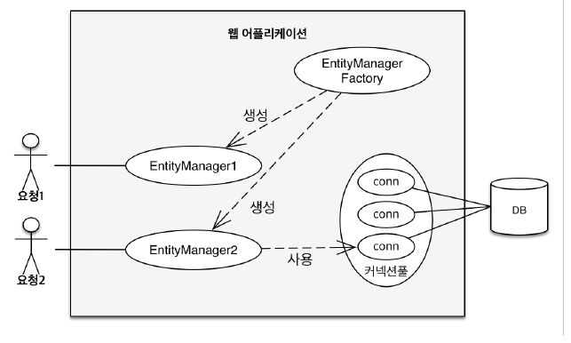

# 영속성 관리

**JPA에서 가장 중요한 2가지**

+ 객체와 관계형 데이터베이스 매핑하기(Object Relational Mapping)
+ 영속성 컨텍스트

---

## 영속성 컨텍스트



EntityManagerFactor는 고객의 요청이 올 때 마다 EntityManager를 생성

EntityManager는 내부적으로 databaseconnection을 사용해서 db를 사용

---

### 영속성 컨텍스트

+ 엔티티를 영구 저장하는 황경
+ **EnityManager.persist(entity)**

사실 persist는 db에 저장하는게 아니라 entity를 영속성 컨텍스트라는 곳에 저장한다는 뜻이다.

+ 영속성 컨텍스트는 논리적인 개념이고 눈에 보이지 않는다.
+ 영속성 컨텍스트는 엔티티 매니저를 통해서 영속성 컨텍스트에 접근한다.

### 엔티티의 생명주기

+ 비영속(new/transient)
  + 영속성 컨텍스트와 전혀 관계가 없는 새로운 상태
+ 영속(managed)
  + 영속성 컨텍스트에 관리되는 상태
+ 준영속(detached)
  + 영속성 컨텍스트에 저장되었다가 분리된 상태
+ 삭제(removed)
  + 삭제된 상태

### 비영속 

JPA와 관계없이 객체만 생성한 상태

```text
//객체를 생성한 상태

Member member = new Member();
member.setId("member1");

...
```

### 영속

entityManager안에 영속성 컨텍스트가 있는데 영속성 컨텍스트 안에 멤버를 저장한 상태 

```java
 public static void main(String[] args) {
        EntityManagerFactory emf = Persistence.createEntityManagerFactory("hello");

        EntityManager em = emf.createEntityManager();

        EntityTransaction tx = em.getTransaction();
        tx.begin();

        try{
            Member member = new Member();
            member.setId(100L);
            member.setName("HelloJPA");

            //영속
            System.out.println("==== BEFORE ====");
            em.persist(member);
            System.out.println("==== AFTER ====");

            tx.commit();


        } catch( Exception e){
            tx.rollback();
        } finally{
            em.close();
        }
        emf.close();
    }
```

해당 결과를 보면

```text
==== BEFORE ====
==== AFTER ====
Hibernate: 
    /* insert hellojpa.Member
        */ insert 
        into
            Member
            (name, id) 
        values
            (?, ?)

```

BEFORE AFTER 사이에 insert query가 날라가지 않았다.

즉 영속 상태가 된다고 db에 날아가지 않고 commit 시점에 쿼리가 날아간다.

### 준영속

영속성 컨텍스트에서 분리하여 준영속 상태가 된다.
`em.detach(member)`

### 삭제

객체를 삭제한 상태(삭제)
`em.remove(member)`

### 영속성 컨텍스트의 이점

+ 1차 캐시
+ 동일성(identity) 보장
+ 트랜잭션을 지원하는 쓰기 지연(transactional write-behind)
+ 변경 감지(Dirty Checking)
+ 지연 로딩(Lazy Loading)